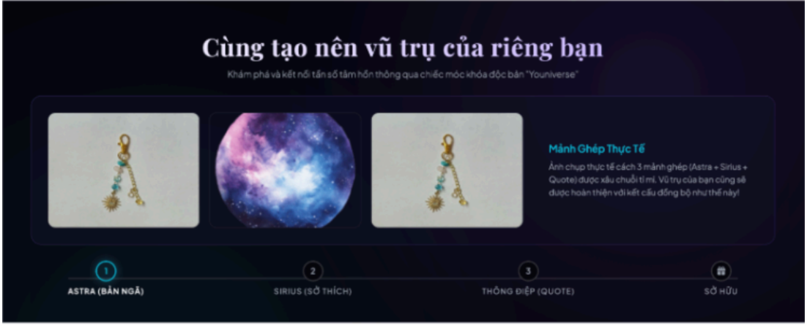
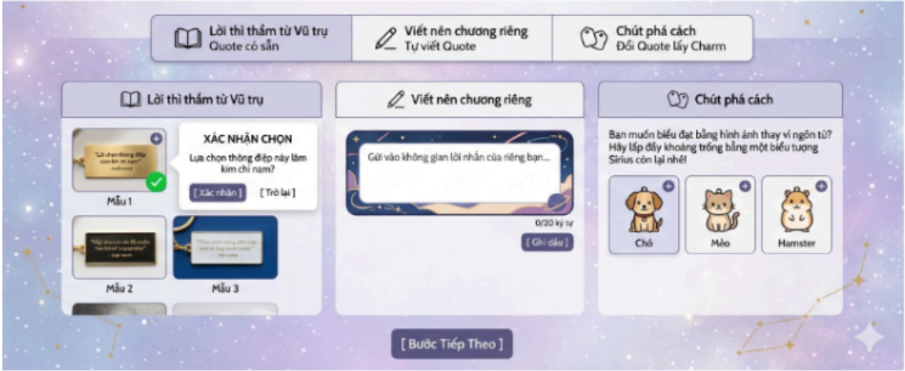

TRANG TIẾNG ANH và TIẾNG VIỆT CHO TRANG MUA HÀNG
Dạ trang mua hàng em muốn có 1 thanh để người dùng xem được mình
đã custom charm được tới đâu rồi ạ
Phía trên cùng sau tiêu đề "Cùng tạo nên vũ trụ của riêng bạn" thì sẽ hiện một
số mẫu móc khoá gồm 3 charm hoàn chỉnh để minh hoạ ở phía dưới kèm
dòng: Ảnh chụp thực tế cách 3 mảnh ghép (Astra + Sirius + Quote) được xâu
chuỗi tỉ mỉ. Vũ trụ của bạn cũng sẽ được hoàn thiện với kết cấu đồng bộ như
thế này!
Sau đó phía dưới là thanh tiến trình và các bước. Một thanh tiến trình tối giản,
các biểu tượng sẽ sáng lên tương ứng với bước khách hàng đang đứng:
(Astra)─── (Sirius) ─── (Quote) ─── Your Youniverse!

BƯỚC 1: Astra
"Mỗi thực thể trong không gian đều mang một tần số năng lượng riêng biệt.
Bạn đang thuộc về hệ nào trong Youniverse?"
1. Chọn Hệ (Hiển thị 3 thẻ tròn lớn, có ảnh chụp charm thật):
● Hệ Mặt Trời (The Sun): Dành cho những tâm hồn năng động, tràn đầy
nhiệt huyết và luôn tỏa sáng rực rỡ.
● Hệ Mặt Trăng (The Moon): Nơi trú ngụ của sự điềm tĩnh, sâu sắc, một
chút bí ẩn và trực giác nhạy bén.
● Hệ Tinh Tú (The Star): Biểu tượng của những ước mơ, sự tự do, lãng
mạn và luôn tìm kiếm điều kỳ diệu.
(Khách hàng click chọn 1 trong 3 hệ, hệ thống tự động trượt mở phần bên
dưới).
2. Ghi tên:
"Bạn có muốn khắc tên riêng (hoặc một nickname) để đánh dấu “chủ quyền”
cho tiểu hành tinh này không?"
● Hiển thị trực quan: Hiện 2 ảnh chụp thật cạnh nhau để khách so sánh
(Ví dụ nếu chọn Mặt Trăng, sẽ hiện ảnh Mặt trăng trơn & Mặt trăng có
ghi chữ).
● Lựa chọn:
○ [ Khắc dấu ấn riêng ] ➔ Hiện ô nhập: "Ghi lại dấu ấn của bạn (Tối
đa 8 ký tự)..."
○ [ Giữ nét nguyên bản ] ➔ Ẩn ô nhập.
Bấm nút [ Tiếp tục hành trình ] ➔ Màn hình trượt mượt mà sang Bước 2.
BƯỚC 2: Sirius
"Hành tinh của bạn sẽ thật cô đơn nếu thiếu đi những niềm vui nhỏ bé mỗi
ngày. Charm Sirius chính là nơi lưu giữ những sở thích của bạn."
1. Câu hỏi phân loại:
“Mảnh ghép tiếp theo, bạn muốn đồng hành cùng một người bạn nhỏ bốn
chân hay năng lượng từ món đồ uống yêu thích?”
Khách hàng chọn 1 trong 2 nút bấm lớn:
· [ Những người bạn bốn chân (Pet) ]
· [ Năng lượng ngọt ngào (Drink) ]
2. Hiển thị danh sách mẫu (Có nút + góc ảnh): (Ảnh em sẽ bổ sung sau)
● Nếu chọn Pet: Hiện ảnh chụp thật của 3 charm: Chó, Mèo, Hamster.
● Nếu chọn Drink: Hiện ảnh chụp thật của 3 charm: Trà sữa, Matcha
Latte, Cà phê.
3. Xác nhận tại chỗ (Micro-interaction):
Khi khách bấm vào nút + của một charm bất kỳ (Ví dụ: Chú Mèo), một ô xác
nhận nhỏ xuất hiện:
"Đặt một chú Mèo nhỏ vào vũ trụ của bạn nhé?" [ Xác nhận ] | [ Thử lựa chọn
khác ]
● Nếu chọn [ Xác nhận ]: Ô đó sẽ đổi màu và hiện dấu Tick xanh (✓) Đã
chọn.
● Một dòng chữ cổ vũ nhỏ xuất hiện ở góc dưới:
"✨Một sự kết hợp tuyệt vời! Chỉ còn một mảnh ghép cuối cùng nữa
thôi là Youniverse của bạn hoàn thành rồi!✨"
Bấm nút [ Đi đến bước cuối ] ➔ Cuộn mượt mà xuống Bước 3.
BƯỚC 3: Polaris
“Một vũ trụ hoàn chỉnh cần một lời tuyên ngôn. Câu nói nào có thể đại diện
cho triết lý sống hoặc tiếng lòng hiện tại của bạn?"
Khách hàng chọn 1 trong 3 tab nội dung (Dạng nút bấm chuyển đổi tại
chỗ):
● Tab 1: Lời thì thầm từ Vũ trụ (Quote có sẵn)
○ Hiển thị các ảnh chụp thẻ Quote thật (Mẫu 1, Mẫu 2, Mẫu 3).
Khách bấm + ➔ Hiện pop-up: "Lựa chọn thông điệp này làm kim
chỉ nam?" ➔ Bấm [ Xác nhận ] (Hiện dấu Tick xanh ✓).
● Tab 2: Viết nên chương riêng (Tự viết Quote)
○ Hiển thị một khung text nghệ thuật: "Gửi vào không gian lời nhắn
của riêng bạn..." (Giới hạn tối đa 20 ký tự).
● Tab 3: Chút phá cách (Đổi Quote lấy Charm)
○ Nội dung: "Bạn muốn biểu đạt bằng hình ảnh thay vì ngôn từ? Hãy
lấp đầy khoảng trống bằng một biểu tượng Sirius còn lại nhé!"
○ Nếu chọn tab này, hệ thống tự động hiển thị 3 option của chủ đề
Sirius còn lại (ở Bước 2 khách chưa chọn) để khách bấm chọn
thêm 1 charm nữa.
Khi hoàn thành Bước 3, giao diện chọn biến mất, màn hình hiển thị chương
cuối cùng dạng một chiếc "Hóa đơn Vũ trụ" tinh tế.
Ví dụ dễ hình dung:

Ảnh này cũng chưa đúng lắm, nếu chọn tab 1 thì hiện mỗi ô 1. Chọn tab 2 thì
hiện ô 2. Chọn tab 3 thì hiện mỗi ô 3. Anh cứ làm theo format a thấy đẹp là
được nha a
Dạ phần thanh toán anh giúp em chèn ảnh QR của shop (Em sẽ gửi sau) + 1
phần để người mua chèn minh chứng chuyển khoản
Lời chúc mừng: "Vũ trụ của riêng bạn đã được khởi tạo thành công! ✨
Đây là sản phẩm được cá nhân hóa và chế tác thủ công theo đúng lựa chọn
của bạn, Youniverse sẽ bắt tay vào hoàn thiện ngay. Các mảnh ghép sẽ được
xâu chuỗi tỉ mỉ tương tự như ảnh minh họa ở đầu trang. Rất nhanh thôi, sản
phẩm độc bản này sẽ được gửi đến tay bạn..."
Dạ phần thanh toán anh giúp em chèn ảnh QR của shop (Em sẽ gửi sau) + 1
phần để người mua chèn minh chứng chuyển khoản